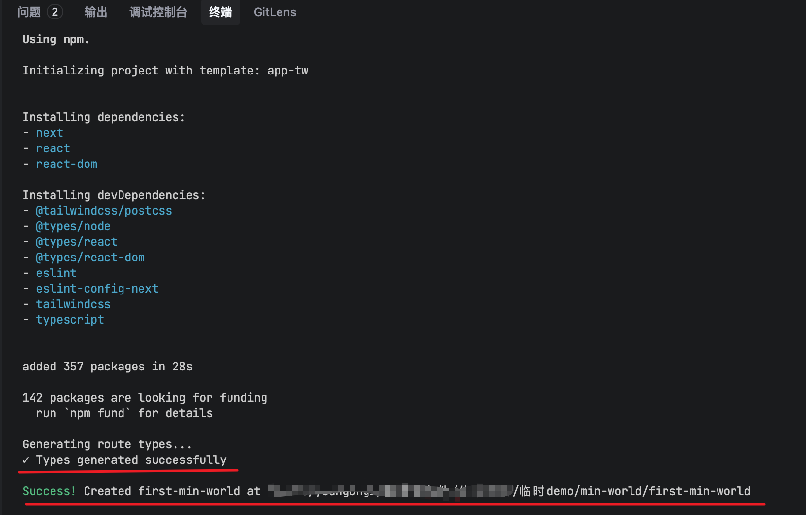
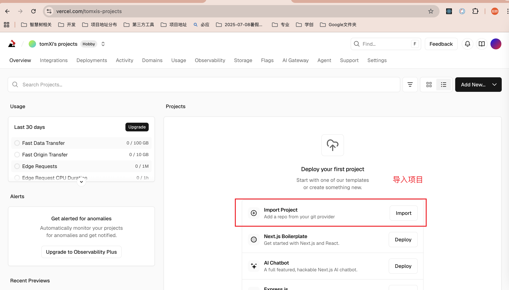
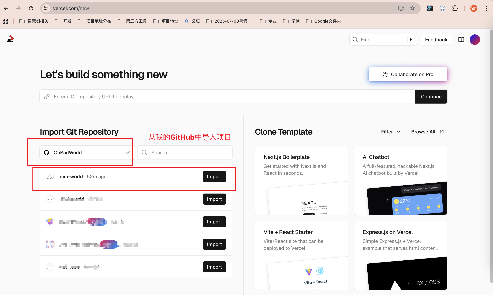
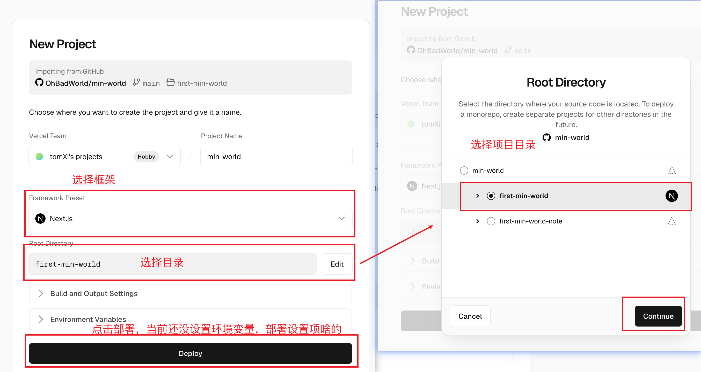
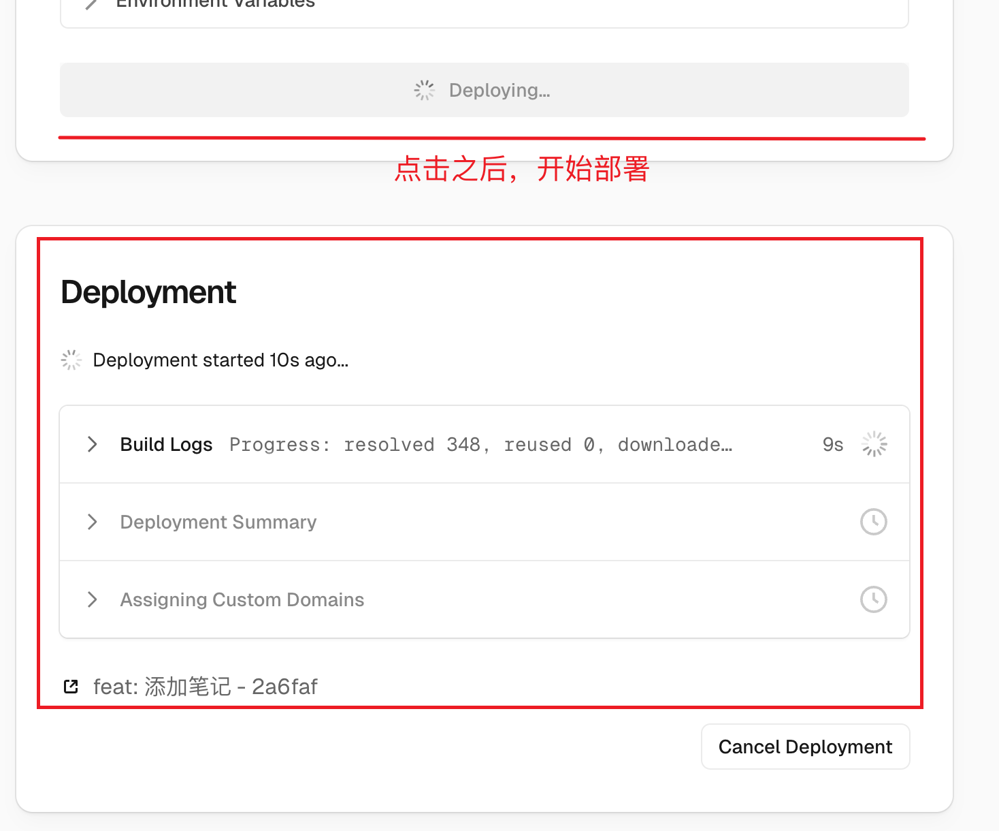
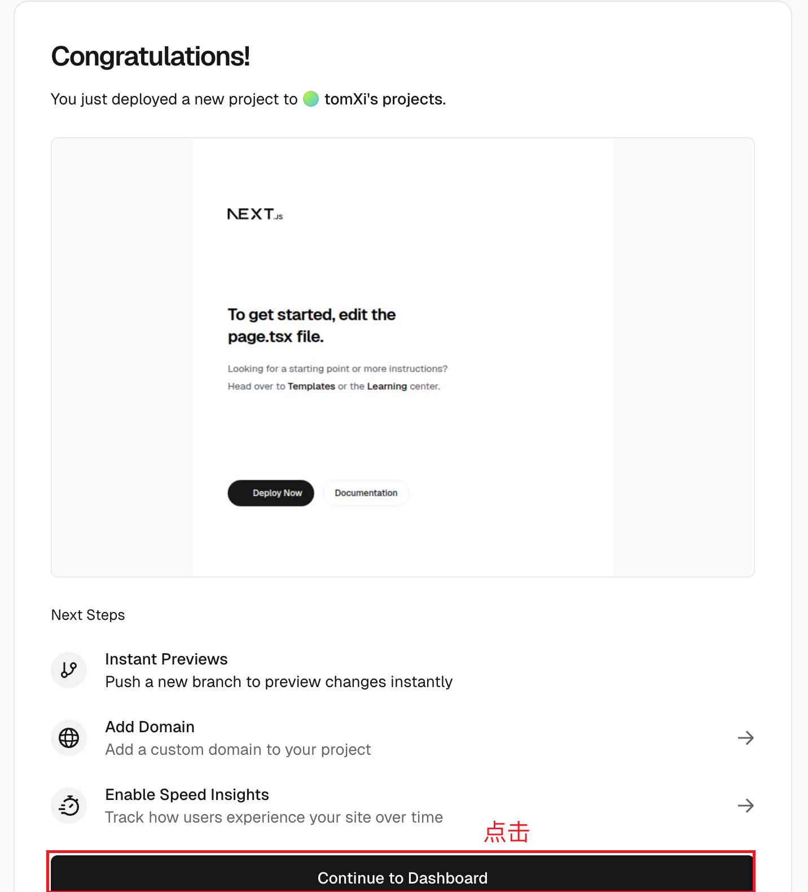

## first-min-world项目的笔记

当前第一个项目：`first-min-world`
技术栈：`next.js`
node环境：`v22.19.0`

[参考链接1](https://juejin.cn/post/7306459858126946354?searchId=20251230111151E2F585937F48A9197B63)

[参考链接2](https://juejin.cn/post/7251512482152349753?searchId=20251230111151E2F585937F48A9197B63)

### 当前这个项目的目标是创建一个简单的next.js项目，实现一个最小化的世界。

部署在vercel上的链接：https://min-world.vercel.app/

部署流程：

